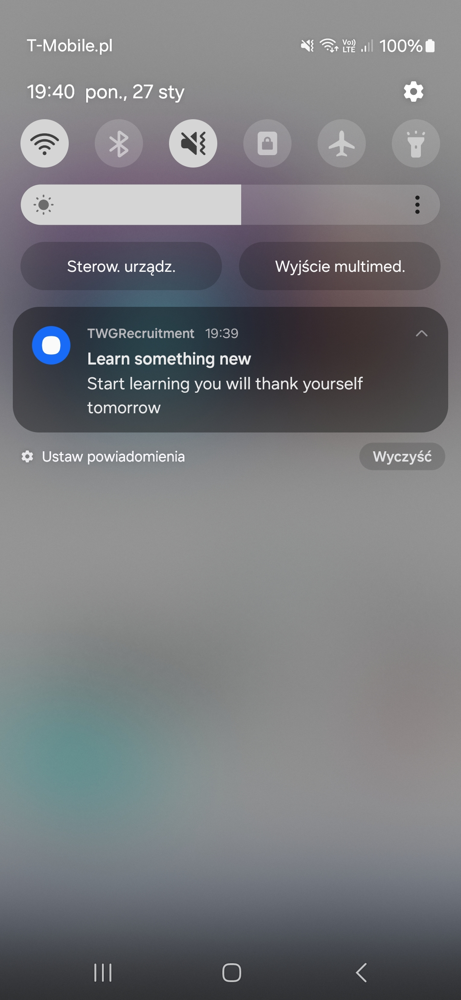

## This app is made for beginner programmers. It helps them gather knowledge from YouTube videos all in one place. ##


used packages:
- "react-native-video": Lets you play videos.
- "@react-native-async-storage/async-storage": Saves your notes.
- "expo-image": Lets you use .svg images.
- "react-native-date-picker": Helps you pick time for reminders.
- "expo-notifications": Sends you notifications.




## Instalation

1. colnoe repository
   ```bash
   git clone https://github.com/michelangelo-source/TWGRecruitment
   ```
2. Install dependencies
   ```bash
   npm install
   ```
3. Insert your YouTube API key into the .env file as 
4. Check if you have the correct environment variables like ANDROID_HOME or JAVA_HOME set
5. Connect your device with USB debugging enabled
6. Start the app 
   ```bash
    npx expo run:android
   ```
